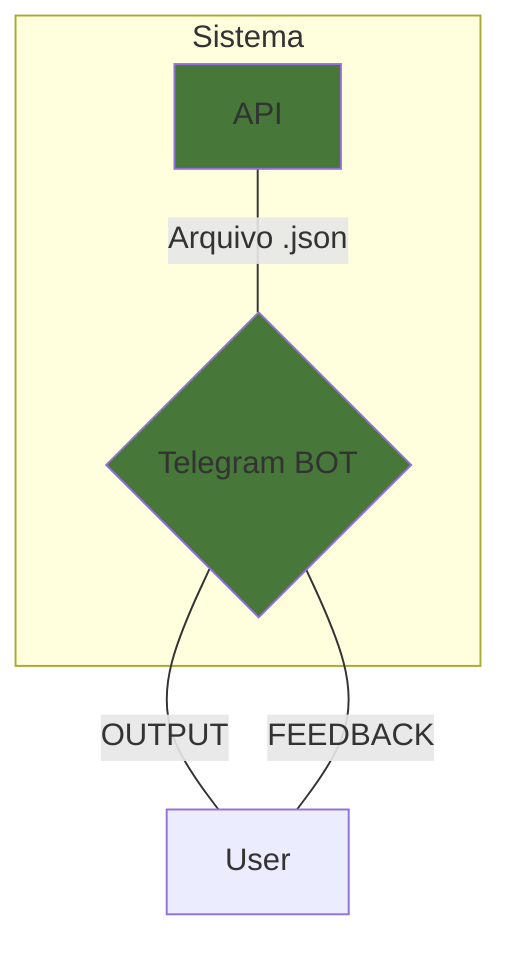
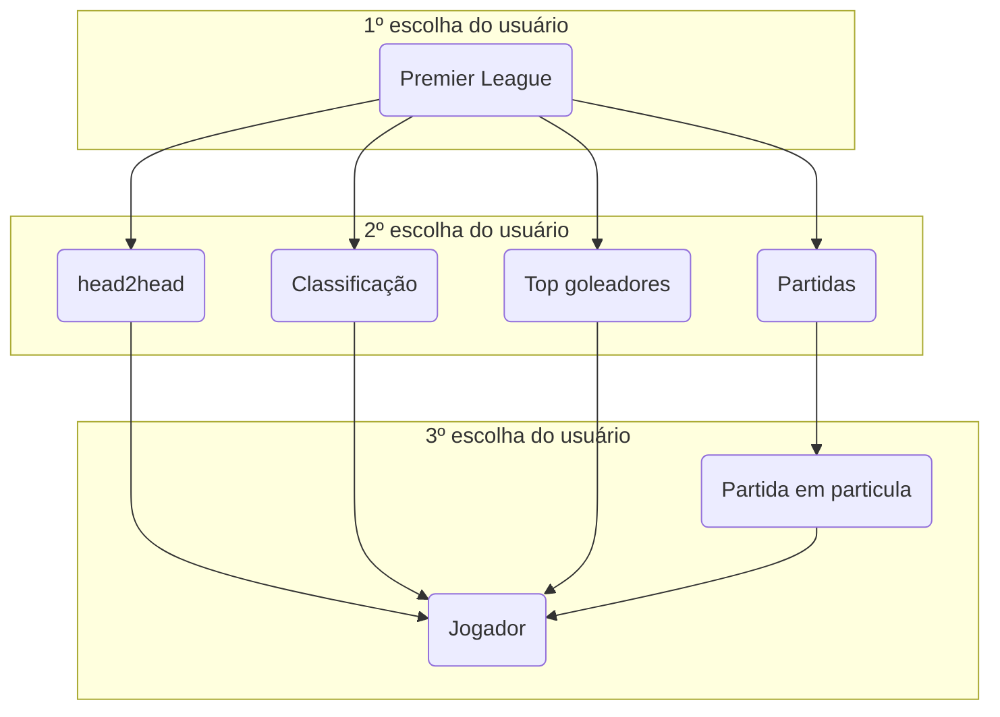

    
     
     

# Resumo

Uma aplicação que integra uma _API_ de dados de futebol com um _Telegram bot_.

## Descrição

Este projeto utiliza Python 3.8.8, um bot do Telegram e uma REST API para demonstrar funcionalidades incríveis.

### Quais informações temos acesso via API?
- Detalhes sobre a partida, como status, horário, ao vivo e etc...  
- Dados sobre o campeonato, como posição do time na tabela, rodada, temporada e etc...  
- As informações de partidas ao vivo são enviadas com um **delay** para contas com acesso gratuito à API.
  - Quanto tempo tem o delay?

## Instalação

## Workflow

## Interação com o usuário

# Issues 
Deve-se encontrar uma maneira de reduzir o numero de if's

# Configurações

[Link da API com as estatísticas de futebol com dados numa forma machine-readable.](https://www.football-data.org/)

[Documentação com informações detalhadas sobre a API](https://www.football-data.org/documentation/quickstart)

