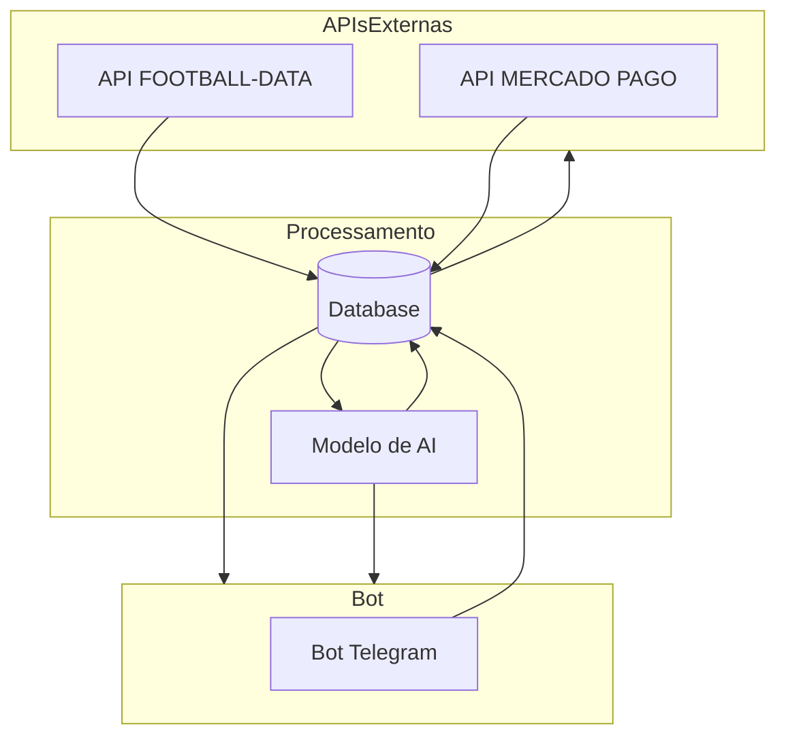

# **Monitore resultados e estatísticas de futebol em tempo real no Telegram com Python**

    
     
     

# Resumo

Este projeto faz integração com 3 APIs. Duas APIs externas, uma para o sistema de pagamento e a outra para o recebimento dos dados de futebol. 

Este produto irá oferecer aos usuários monitoramento **gratuito** sobre seus times e campeonatos preferidos. E oferecerá acesso à nossa **inteligência artificial que realiza previsões** dos eventos esportivos, a partir de uma mensalidade bastante acessível.

### Quais informações temos acesso via API?
- Detalhes sobre a partida, como status, horário, ao vivo e etc...  
- Dados sobre o campeonato, como posição do time na tabela, rodada, temporada e etc...  
- As informações de partidas ao vivo são enviadas com um **delay** para contas com acesso gratuito à API.
  - Quanto tempo tem o delay?

## Tecnologias

**Linguagem de programação**
> Python == 3.8.8

**Bibliotecas**
> Requests  
> Python-Telegram-Bot

## Arquitetura do projeto

## Interação do bot com o usuário

<html lang="en">
<head>
    <meta charset="UTF-8">
    <meta name="viewport" content="width=device-width, initial-scale=1.0">
    <title>Centralizar GIF
    </title>
    
</head>
<body>
    

        
    

</body>
</html>

# Licensa

Attribution-NonCommercial 4.0 International
