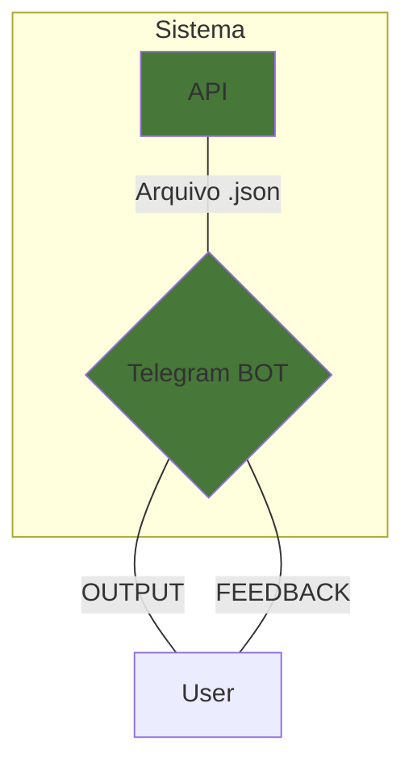

    
     
     

## Descrição

Este projeto utiliza Python 3.11, um bot do Telegram e uma REST API para demonstrar funcionalidades incríveis.

## Instalação

# Resumo

Uma aplicação que integra uma _API_ de dados de futebol com um _Telegram bot_.

## Workflow

# Configurações

[Link da API com as estatísticas de futebol com dados numa forma machine-readable.](https://www.football-data.org/)

